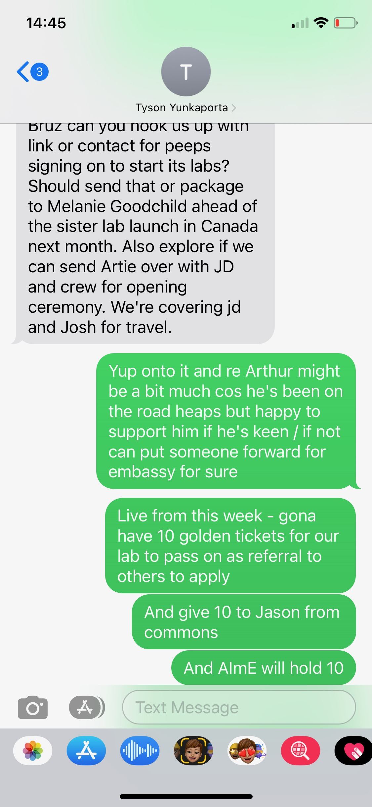

# Golden Ticket Visa campaign

1. Golden tickets serve as a referral, not a guarantee of acceptance, but they indicate that the person should be deeply considered for their body of work.
2. Golden tickets come from trusted custodians within imagination, which can include staff members or network of network leaders and support.
3. The primary focus should be on the distribution of golden tickets, and the team needs to determine who is responsible for this task.
4. One person should be assigned to follow up with the golden ticket recipients, keeping the process simple.
5. If someone wants to volunteer for this role, they can raise their hand and take on the responsibility.
6. The team is focusing on golden tickets as a pathway for new visa holders to join.
7. HR (Christy) will set targets for each staff member for the next six months, including the number of dreams to build and other specific goals.
8. The targets will be communicated via email, letting each team member know what they need to do.
9. Tutor squads and four or five other initiatives should start from June 1st, giving people time to prepare and set a baseline.
10. Christy and Georgie will provide support to team members as needed.
11. The global announcement channel needs to shift focus from celebrating current achievements to promoting the golden ticket support and pathways for new visa holders.
12. The call to action for the Friday acts should be clear and focused on these new initiatives.
13. The team should focus on their individual responsibilities within the embassy to deliver tools and continue building bridges and deepening the system.

<figure><figcaption></figcaption></figure>
